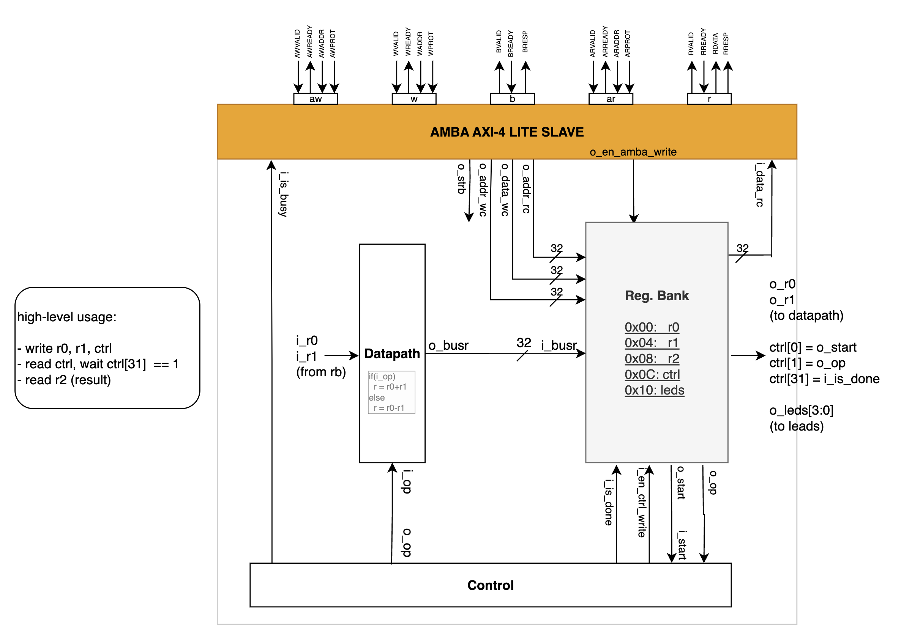

# Adder AMBA AXI-4 Lite

This is a straightforward design for adding or subtracting a 32-bit word to demonstrate how it can be integrated with a processor (AXI-4 Lite Master) and AXI-4 Lite Interconnect and synthesized in an FPGA, enabling the use of the IP by software.

## Macroarchitecture

## TODO: Vivado Flow

Tool:
- Vivado 2023.2